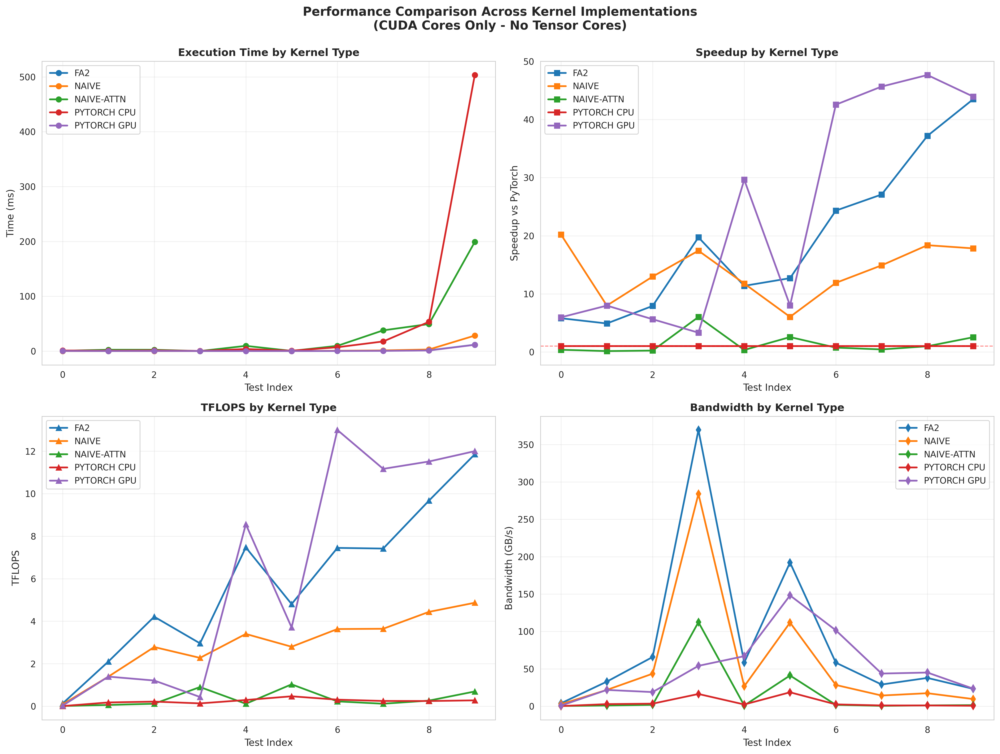
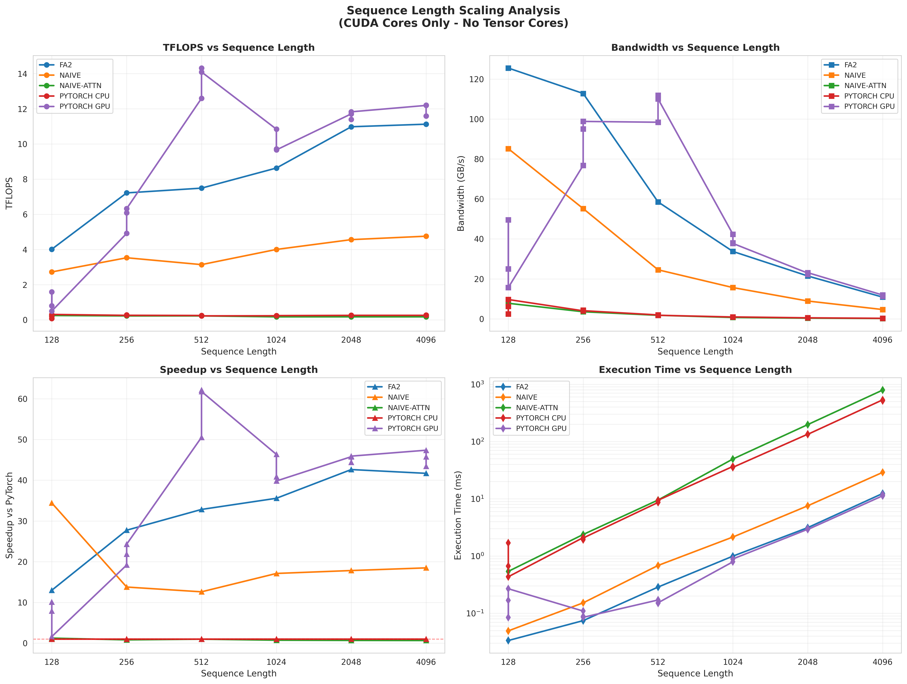
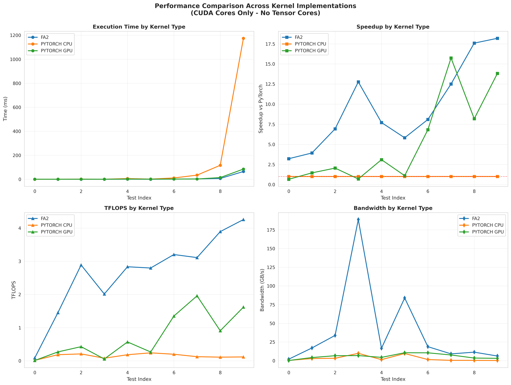

# CUDA Flash Attention 2

## Project Overview

This project contains a comprehensive implementation of the Flash Attention 2 algorithm in CUDA, **utilizing CUDA Cores ONLY!**, along with comparisons to naive attention implementations, Flash Attention 1 and PyTorch solutions. The project includes both forward pass and backward pass, enabling full training of models utilizing the attention mechanism.
Additionally, the project delivers a testing framework written in Python where experiments can be run. Several experiments are described in this README below along with results and conclusions.

**NOTE**: This project is strictly educational and focuses on CUDA Cores implementation only. While functional, CUDA Cores are significantly less efficient than Tensor Cores for matrix operations like attention, resulting in much lower performance compared to production implementations. Tensor Cores provide specialized hardware for mixed-precision matrix multiplication with much higher throughput. Expansion to Tensor Core utilization is planned for future development.

### Implemented Kernels

1. **Optimized Flash Attention 2 (FA2)** - FA2 algorithm implementation with optimizations:
   - Tiling in shared memory
   - Online softmax with numerical stability
   - Memory bandwidth optimization
   - Support for forward and backward pass

2. **Flash Attention 1 (FA1)** - Base Flash Attention 1 forward pass implementation

3. **Naive Flash Attention 2** - Base Flash Attention 2 forward pass implementation

4. **Naive Attention** - Simplest attention mechanism implementation

### Python Testing Framework

The project includes an advanced testing framework written in Python (`test_flash_attention2.py`), which provides:

- **Compilation and execution of CUDA kernels** directly from Python using CuPy
- **Test data generation** with controlled seed for reproducibility
- **Comparison with reference implementations**:
  - PyTorch CPU
  - PyTorch GPU (`F.scaled_dot_product_attention`)
  - CUDA implementations (naive attention kernel, naive FlashAttention kernel, FA2)
- **Detailed performance metrics**:
  - Execution time (ms)
  - Speedup relative to PyTorch
  - TFLOPS (Tera Floating Point Operations per Second)
  - Bandwidth (GB/s)
- **Accuracy metrics**:
  - Maximum absolute error
  - Mean absolute error
  - MSE (Mean Squared Error)
  - Maximum relative error
- **Automatic report generation**:
  - CSV files with results
  - Comparative plots (matplotlib + seaborn)
  - Text format summaries

## Requirements

### Software
- **CUDA Toolkit** 12.6 or newer (other versions possible, see CMakeLists.txt)
- **CMake** 3.18 or newer
- **C++ Compiler** with C++14 support
- **Python** 3.11+ (for testing framework) + dependencies

#### Python Libraries
```bash
pip install torch numpy cupy-cuda12x matplotlib seaborn pandas tabulate
```

**Note**: Instead of `cupy-cuda12x`, use the appropriate version for your CUDA installation (e.g., `cupy-cuda11x` for CUDA 11.x).

## Project Compilation

### 1. Environment Setup

Ensure that CUDA Toolkit is installed and added to PATH:
```bash
export PATH=/usr/local/cuda-12.6/bin:$PATH
export LD_LIBRARY_PATH=/usr/local/cuda-12.6/lib64:$LD_LIBRARY_PATH
```

### 2. Compilation with CMake

```bash
# Create build directory
mkdir -p build
cd build

# CMake configuration
cmake ..

# Compile project
make
```

After compilation, the `FlashAttention` executable will be created in the `build/` directory.

## Generating Test Data

Before running the program, generate test data:

```bash
python generate_test_data.py --batch_size 2 --num_heads 8 --seq_len 512 --head_dim 64
```

### `generate_test_data.py` Parameters:
- `--batch_size` - Batch size (default: 2)
- `--num_heads` - Number of attention heads (default: 8)
- `--seq_len` - Sequence length (default: 512)
- `--head_dim` - Dimension of each head (default: 64)
- `--output_dir` - Output directory (default: `./data`)
- `--seed` - Random number generator seed (default: 42)

Data will be saved in `data/B{batch}_H{heads}_S{seq}_D{dim}/` directory as binary files:
- `Q.bin` - Query matrix
- `K.bin` - Key matrix
- `V.bin` - Value matrix

## Running the CUDA Program

### Basic Usage

```bash
./build/FlashAttention --compute <METHOD> --mode <MODE> --data <DATA_PATH>
```

### Command Line Parameters

#### `--compute` - Computation method:
- `fa2` - Flash Attention 2 (optimized FA2 implementation)
- `fa1` - Flash Attention 1 (base FA1 implementation)
- `naive` - Vanilla Attention (naive implementation)

#### `--mode` - Operation mode:
- `forward` - Forward pass only (default)
- `backward` - Backward pass only (requires previously computed forward pass)
- `both` - Forward and backward pass

#### `--data` - Data path:
- Directory containing `Q.bin`, `K.bin`, `V.bin` files
- Format: `./data/B{batch}_H{heads}_S{seq}_D{dim}`

### Usage Examples

#### Forward pass with Flash Attention 2:
```bash
./build/FlashAttention --compute fa2 --mode forward --data ./data/B2_H8_S512_D64
```

#### Forward and backward pass:
```bash
./build/FlashAttention --compute fa2 --mode both --data ./data/B2_H8_S512_D64
```

#### Comparison with naive implementation:
```bash
./build/FlashAttention --compute naive --mode forward --data ./data/B2_H8_S512_D64
```

### Output Files

The program saves results in the same directory as input data:

**Forward pass:**
- `O.bin` - Output
- `logsumexp.bin` - Log-sum-exp for each row (needed for backward pass)

**Backward pass:**
- `dQ.bin` - Gradient with respect to Query
- `dK.bin` - Gradient with respect to Key
- `dV.bin` - Gradient with respect to Value

## Python Testing Framework

### Framework Capabilities

The `test_flash_attention2.py` testing framework offers:

1. **Automatic CUDA kernel compilation** via CuPy
2. **Comparison with reference PyTorch implementations**
3. **Testing multiple configurations** simultaneously
4. **Generating detailed reports** with metrics
5. **Automatic plot generation** for comparisons
6. **Support for forward and backward pass**


### Running Tests

#### Forward Pass Test - Implementation Comparison

```bash
python test_flash_attention2.py --mode forward --experiment
```

This test compares:
- **PyTorch CPU** - Baseline CPU implementation
- **PyTorch GPU** - `F.scaled_dot_product_attention` on GPU
- **Plain Naive Attention** - Naive attention
- **Naive Base FA2** - Simplest CUDA FA2 implementation
- **Optimized Flash Attention 2** - Optimized FA2 implementation

### Command-Line Arguments

The testing framework provides several command-line arguments for flexible testing:

```bash
python test_flash_attention2.py --mode <MODE> [OPTIONS]
```

#### Required Arguments

**`--mode`** - Test mode selection (required)
- `forward` - Test forward pass only
- `backward` - Test backward pass only (uses PyTorch forward + CUDA backward)
- `both` - Test both forward and backward passes together

#### Optional Arguments

**`--kernel`** - Kernel implementation to test (default: `fa2`)
- `fa2` - Flash Attention 2 (optimized, recommended)
- `naive-attn` - Plain naive attention kernel
- `naive` - Naive Flash Attention 2

**`--experiment`** - Run comprehensive comparison experiment
- Compares all kernel implementations across all test configurations
- Automatically tests: PyTorch CPU, PyTorch GPU, Naive, Plain Naive, FA2
- Generates detailed comparison plots and CSV results

**`--seqlen-experiment`** - Run sequence length scaling experiment
- Tests performance scaling from sequence length 128 to 4096
- Fixed configuration: Batch=4, Heads=8, HeadDim=64
- Analyzes how O(N²) complexity affects different implementations

**`--tolerance`** - Error tolerance for test passing (default: `1e-3`)
- Maximum acceptable error between CUDA output and PyTorch reference
- Tests fail if error exceeds this threshold

**`--no-stop-on-failure`** - Continue testing after failures
- By default, testing stops on first failure
- Use this flag to run all tests regardless of failures

**`--save-results`** - Save results and generate plots
- Saves detailed CSV with all metrics
- Generates comparison plots (execution time, speedup, TFLOPS, bandwidth)
- Creates sequence length scaling analysis (if applicable)

**`--output-dir`** - Output directory for results (default: `./experiment_results`)
- Specifies where CSV files and plots are saved

**`--no-gpu-reference`** - Disabling PyTorch GPU reference

#### Usage Examples

**Basic forward pass test with FA2:**
```bash
python test_flash_attention2.py --mode forward --kernel fa2
```

**Comprehensive experiment with all implementations:**
```bash
python test_flash_attention2.py --mode forward --experiment --save-results
```

**Sequence length scaling experiment:**
```bash
python test_flash_attention2.py --mode forward --seqlen-experiment --save-results --output-dir ./plots
```

## Conducted Experiments

All experiments were performed on a RTX 5090 and 16-Core AMD CPU

### Forward Pass Experiments

#### 1. Implementation Comparison Across Different Sizes

The following implementations were tested:
1. **PyTorch CPU** - Reference implementation on CPU by PyTorch team
2. **PyTorch GPU** - Scaled Dot Product Attention on GPU by PyTorch team
3. **Naive-Attn** - Simplest CUDA attention implementation
4. **Naive-FA2** - Naive Flash Attention 2
5. **Flash Attention 2 (FA2)** - Optimized implementation

**Test configurations:**
0. **Small-1**: Batch=1, Heads=1, SeqLen=128, HeadDim=64
1. **Small-2**: Batch=2, Heads=4, SeqLen=256, HeadDim=64
2. **Small-3**: Batch=2, Heads=8, SeqLen=256, HeadDim=64
3. **Edge-SmallSeq**: Batch=8, Heads=16, SeqLen=32, HeadDim=64
4. **Medium-1**: Batch=2, Heads=8, SeqLen=512, HeadDim=64
5. **Edge-NonPowerOf2**: Batch=8, Heads=16, SeqLen=100, HeadDim=64
6.  **Medium-2**: Batch=4, Heads=8, SeqLen=512, HeadDim=64
7. **Large-1**: Batch=2, Heads=8, SeqLen=1024, HeadDim=64
8. **Large-2**: Batch=4, Heads=12, SeqLen=1024, HeadDim=64
9. **Stress-1**: Batch=8, Heads=16, SeqLen=2048, HeadDim=64

**Metrics:**
- Execution time (ms)
- Speedup relative to PyTorch CPU
- TFLOPS
- Memory bandwidth (GB/s)
- Numerical errors (max abs error, MSE)

#### Results - Implementation Comparison

| Kernel        | Mean KernelTime_ms | Mean Speedup   |Mean TFLOPS   |Mean Bandwidth_GBps |
|---------------|---------------|-----------|----------|----------------|
| PYTORCH CPU   | 58.535004     | 1.000000  | 0.249366 | 4.940126       |
| NAIVE-ATTN    | 32.246943     | 1.562586  | 0.348631 | 16.308369      |
| NAIVE-FA2     | 3.413966      | 14.707034 | 2.891666 | 55.606076      |
| FA2           | 1.425449      | 20.141587 | 5.739763 | 88.591320      |
| PYTORCH GPU   | 1.520514      | 21.316063 | 5.847802 | 49.570369      |




#### 2. Impact of Sequence Length on Performance

Tested how varying sequence length affects performance of different implementations.

**Configurations:**
- Batch size: 4
- Num heads: 8
- Seq length: 128, 256, 512, 1024, 2048, 4096
- Head dim: 64



### Backward Pass Experiments

#### 3. Backward Pass Comparison

Backward pass was tested for:
1. **PyTorch CPU** - Automatic differentiation on CPU
2. **PyTorch GPU** - Automatic differentiation on GPU
3. **Flash Attention 2 Backward** - Manual backward pass implementation

**Test configurations:**
The same as in the 1st experiment.


| Kernel        | Mean KernelTime_ms | Mean Speedup  | Mean TFLOPS   | Mean Bandwidth_GBps |
|---------------|---------------|----------|----------|----------------|
| PYTORCH CPU   | 132.464004    | 1.000000 | 0.153913 | 2.865216       |
| FA2           | 7.677764      | 9.696618 | 2.683783 | 40.017586      |
| PYTORCH GPU   | 10.707116     | 5.276990 | 0.740192 | 5.760524       |



## Results Analysis and Conclusions

### 1. Forward Pass Performance

#### Flash Attention 2 vs Naive Implementations
- **Flash Attention 2 (FA2) consistently outperforms all naive CUDA implementations**, with speedups ranging from **~10× to over 20×** depending on sequence length and batch configuration.
- The performance gains come from:
  - **Tiled computation** that improves data locality
  - **Online softmax** that avoids materializing the full attention matrix
  - **Reduced global memory traffic**, replacing repeated reads/writes with shared-memory reuse
- While FA2 does not change the theoretical **O(N²)** compute complexity, it **dramatically reduces constant factors**, which is clearly visible in both execution time and TFLOPS metrics.

#### FA2 vs PyTorch GPU
- FA2 achieves **comparable performance to PyTorch GPU** for medium and large sequence lengths.
- PyTorch GPU shows strong performance due to internally optimized kernels (cuBLAS / fused attention paths), but FA2 often achieves **higher effective memory bandwidth**

---

### 2. Memory Bandwidth and Compute Utilization

- FA2 reaches **substantially higher effective memory bandwidth** than naive CUDA kernels and PyTorch CPU.
- Peak observed bandwidth:
  - FA2: **~80–120 GB/s**, depending on configuration
  - PyTorch GPU: lower and more variable
- This indicates:
  - Efficient memory coalescing
  - High shared-memory reuse
  - Reduced redundant global memory accesses
- Despite these gains, **FA2 does not reach the theoretical peak GPU bandwidth**, confirming that attention remains a **mixed memory–compute workload**, not purely memory-bound.

---

### 3. Scaling with Sequence Length

#### Execution Time Scaling
- All implementations exhibit **quadratic scaling (O(N²))** with respect to sequence length, consistent with attention’s theoretical complexity.
- FA2 shows the **lowest absolute growth rate**, meaning:
  - The quadratic trend is unavoidable
  - But FA2 shifts the curve downward significantly

#### Compute-Bound vs Memory-Bound Regimes
- For **small sequence lengths**, performance is largely **memory-bound** and dominated by overhead.
- As sequence length increases:
  - Arithmetic intensity increases
  - Kernels become more **compute-bound**
  - FA2 benefits disproportionately from this transition

---

### 4. Numerical Accuracy and Stability

- All CUDA-based implementations show **excellent numerical agreement** with PyTorch reference results.
- Observed errors:
  - Maximum absolute error: **< 1e-6**
  - MSE: **~1e-14 to 1e-15**
- These values are consistent with **float32 precision limits**.
- FA2’s online softmax:
  - Uses block-wise max subtraction
  - Maintains running log-sum-exp
  - Avoids numerical overflow/underflow
- No instability was observed, even for long sequences and high batch sizes.

---

### 5. Backward Pass Performance

- The FA2 backward kernel provides a **~9–10× speedup over PyTorch CPU** and a **~1.4×–1.6× speedup over PyTorch GPU** on average.
- Performance gains stem from:
  - Reusing forward-pass statistics (logsumexp)
  - Avoiding storage of the full attention matrix
  - Tiled gradient computation
- Although FA2 backward is significantly faster than PyTorch CPU, **PyTorch GPU remains competitive**, indicating that backward attention is already highly optimized in existing frameworks.

---

### 6. Memory Footprint and Training Implications

- FA2 requires only **O(N)** additional memory for auxiliary data (e.g., logsumexp vectors).
- This is a critical improvement over naive attention approaches that implicitly require **O(N²)** memory.
- Practical implications:
  - Enables **longer sequence lengths**
  - Allows **larger batch sizes**
  - Reduces memory pressure during training
- These properties are especially important for:
  - Large language models
  - Long-context transformers
  - Memory-constrained training setups

## Project Structure

```
CUDA-flash-attention/
├── CMakeLists.txt              # CMake configuration
├── README.md                   # This file
├── generate_test_data.py       # Data generator
├── test_flash_attention2.py    # Python testing framework
│
├── include/                   # Header files
│   ├── dispatcher.h           # Dispatcher for different head_dim
│   ├── enum_types.h           # Enum definitions (ComputeType, ModeType)
│   ├── error_utils.h          # CUDA error handling utilities
│   ├── timer.h                # GPU and CPU timer
│   └── utils.h                # Utilities (I/O, parsing)
│
├── kernels/                       # CUDA kernel implementations
│   ├── kernel_fa2_optimized.cu    # Flash Attention 2 (forward)
│   ├── f-attn2-backward.cu        # Flash Attention 2 (backward)
│   ├── f-attn2.cuh                # FA2 header
│   ├── f-attn.cu                  # Flash Attention 1
│   ├── f-attn.cuh                 # FA1 header
│   ├── vanilla-attn.cu            # Vanilla attention
│   ├── vanilla-attn.cuh           # Vanilla header
│   └── plain-attn.cu              # Base, Naive FA2 forward
│
├── src/                       # C++ source code
│   ├── main.cpp               # Main program function
│   └── utils.cpp              # Utilities implementation
│
├── data/                       # Test data (generated)
│   ├── B2_H8_S512_D64/
│   │   ├── Q.bin
│   │   ├── K.bin
│   │   ├── V.bin
│   │   └── O.bin (after execution)
│   └── ...
│
├── experiment_results/                  # Experiment results
│   ├── experiment_results.csv
│   ├── backward_experiment_results.csv
│   └── (plots - generated by framework)
│
└── build/                     # Compilation directory (generated)
    └── FlashAttention         # Executable file
```

## Flash Attention 2 Algorithm

### Main Idea

Flash Attention 2 solves the memory-bound nature of standard attention mechanism through:

1. **Tiling:**
   - Divides Q, K, V matrices into smaller blocks
   - Processes blocks in GPU shared memory
   - Reduces number of accesses to slow global memory

2. **Online Softmax:**
   - Computes softmax incrementally while processing blocks
   - Does not require materializing full attention scores matrix O(N²)
   - Uses only O(N) additional memory

3. **Kernel Fusion:**
   - Combines multiple operations into a single kernel
   - Eliminates intermediate writes to global memory
   - Increases data locality

## **Limitations:**
- It's CUDA Cores implementation ONLY

## **Possible Improvements:**
- Mixed precision support (FP16/BF16)
- Tensor Core implementation
- GEMM optimizations 


## References

1. **Flash Attention** - Dao, T., Fu, D. Y., Ermon, S., Rudra, A., & Ré, C. (2022). 
   "FlashAttention: Fast and Memory-Efficient Exact Attention with IO-Awareness"
   - Paper: https://arxiv.org/abs/2205.14135

2. **Flash Attention 2** - Dao, T. (2023).
   "FlashAttention-2: Faster Attention with Better Parallelism and Work Partitioning"
   - Paper: https://arxiv.org/abs/2307.08691